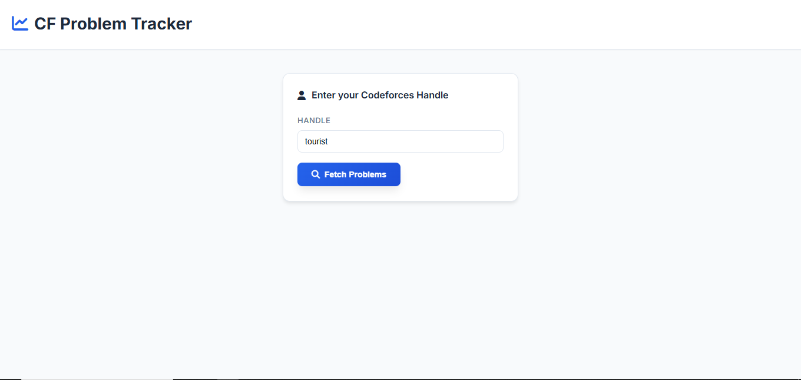
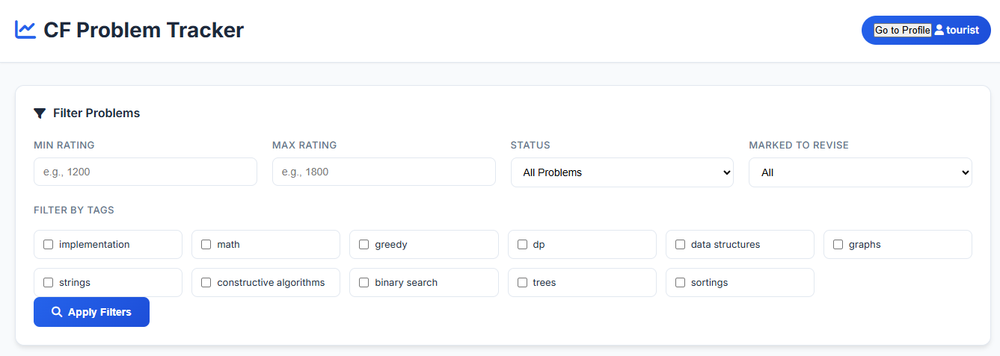
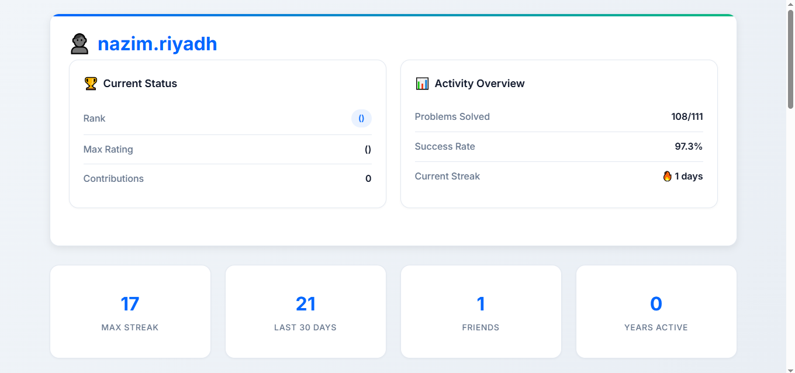
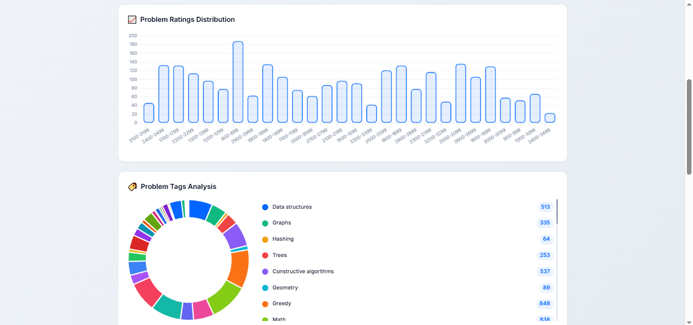
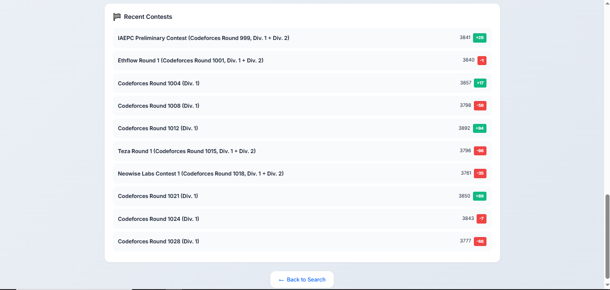

# 💻 Codeforces Problem Tracker

Track, analyze, and improve your Codeforces performance with this powerful Flask-based web app.

---

## 🚀 Features

- 📊 Profile overview: solved/unsolved stats, rating-wise and tag-wise distribution
- 🔍 Advanced filters: filter by tag, rating, verdict, and revision status
- 📅 Daily login streak chart
- 📝 Problem Notes: add personal notes for each problem
- 🧠 Revise Queue: mark problems for later revision
- 📥 Export data to CSV
- 🧾 Full Codeforces handle analytics

---

## 🖼️ Screenshots

### 🏠 index


### 🔍 Filter Problems



### 📊 Login Streak Chart



### 📅 Login Streak Chart


### 📝 Contest


---

## ⚙️ Installation

```bash
git clone https://github.com/your-username/codeforces-tracker.git
cd codeforces-tracker
pip install -r requirements.txt
python app.py
```

Then go to:  
👉 `http://127.0.0.1:5000/`

---

## 🌐 Deployment

To deploy on **Vercel** or **Render**:

- Use `render.com` for easier Flask deployment.
- For Vercel, you may need to adapt the app using a `vercel-python` compatible handler (or convert to FastAPI for full support).

---

## 🧩 Built With

- Python 3
- Flask
- Jinja2 Templates
- Bootstrap 5
- Chart.js
- Codeforces API

---

## 📄 License

MIT License  
© 2025 Nazim Riyadh

---

## 📬 Feedback & Contributions

If you find a bug or want to contribute, feel free to open an issue or PR.
